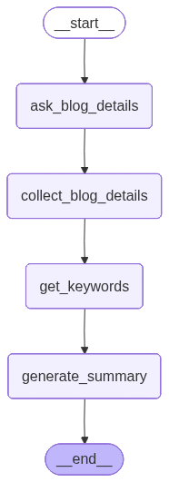
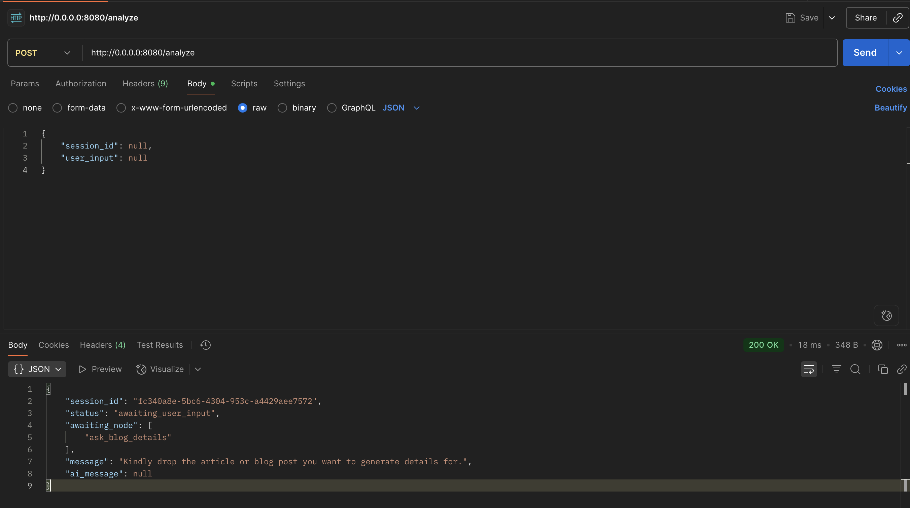
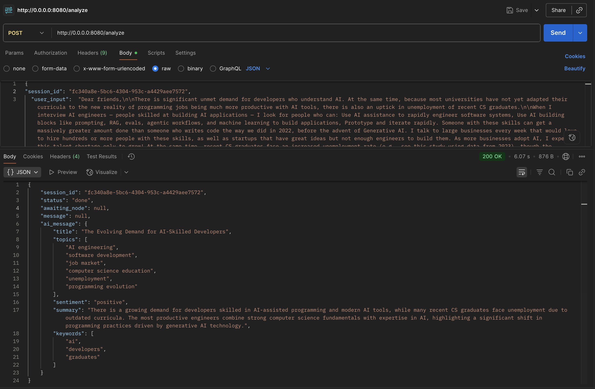
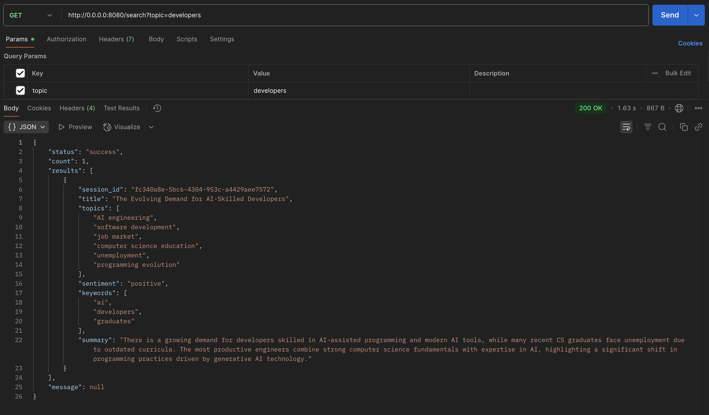
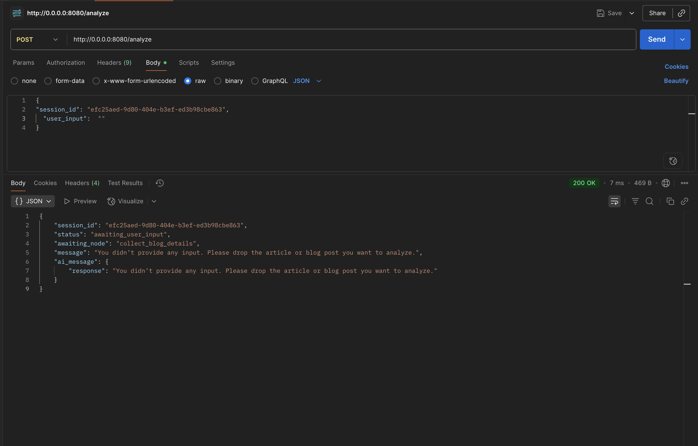

# AI Blog Analysis & Search Service

This project is a lightweight **FastAPI** service built on **Langgraph** designed for analyzing blog content and performing search operations. It leverages **Pydantic** for robust data validation and includes light weight unit tests with **pytest**. The service is designed for efficiency and easy deployment, with a lightweight **Alpine-based Docker image**. Its modular structure makes it easy to test and extend for future features like batch processing.

-----

## 🚀 Setup & Run Instructions

### 1\. Clone the Repository

```bash
git clone https://github.com/JoAmps/Jouster.git
```

### 2\. Set Up the Environment

First, create a virtual environment and activate it.

```bash
python -m venv venv
```

**On Mac/Linux:**

```bash
source venv/bin/activate
```

**On Windows:**

```bash
venv\Scripts\activate
```

### 3\. Install Dependencies

Before installing, create a `.env` file inside the `llm_models` folder. This file should contain your OpenAI API key and the model name you want to use. We recommend using `gpt-4.1-mini` or `gpt-4.1` for the best results.

```dotenv
openai_api_key="your key goes here"
model_name="your model name goes here"
```

Now, install the required packages.

```bash
pip install -r requirements.txt
```

### 4\. Run the FastAPI App

Start the service using `uvicorn`.

```bash
uvicorn main:app --reload
```

You can view the interactive API documentation at: **[http://0.0.0.0:8080/docs](http://0.0.0.0:8080/docs)**

### 5\. Run Tests

Execute the unit tests with `pytest`.

```bash
pytest -s -v test_cases.py
```

### 6\. Build & Run with Docker

To containerize and run the service, use these commands.

```bash
docker build -t ai-blog-service .
docker run -p 8080:8080 ai-blog-service
```

-----

## 💡 Design Choices

  * **Modularity:** The code is structured with a clear separation of concerns, with dedicated modules for **LLM interaction**, **blog detail extraction**, **database persistence**, and **API endpoints**. This makes the service easy to test and extend.
  * **FastAPI:** Chosen for its high performance, developer-friendly syntax, and automatic generation of OpenAPI documentation.
  * **Pydantic:** Ensures type-safe, validated data throughout the entire application workflow.
  * **Async Operations:** The use of asynchronous database operations allows the application to handle multiple requests efficiently without blocking.
  * **GPT-4.1-mini:** Selected for its excellent balance of speed, low latency, and accuracy in generating structured results.
  * **LangGraph:** Used as the LLM orchestration layer due to its low-level flexibility, enabling highly customized and extensible workflows, even though the prototype is straightforward enough and doesnt include any conditional edges and a lot of logic.
  * **PostgreSQL:** Used as the database to store all the analysis.
  * **Human-in-the-Loop:** LangGraph's Interrupt and Command features are integrated to support human intervention in the workflows.
  * **In-Memory Checkpointer:** This is used for session state in the prototype. **Note:** In a production environment, this should be replaced with a persistent solution like Redis or PostgreSQL to prevent state loss upon restart.

-----

## 🤔 Trade-offs

  * **Batch Processing:** Due to time constraints, current batch processing is sequential rather than parallel.
  * **LLM Error Handling:** The current error handling is basic. A production-ready solution would require more sophisticated retries and fallback mechanisms.
  * **Single-Text Processing:** The service currently supports processing a single text per session. Minor modifications would be needed to support multiple texts.
  * **State Persistence:** The in-memory checkpointer will lose all state if the application restarts. Persistent storage is required for production reliability.

-----

## 📈 Future Improvements

  * Implement parallel batch processing with a robust queue management system.
  * Enhance LLM error handling with automatic retries, fallbacks, and improved logging.
  * Replace the in-memory checkpointer with a persistent database solution for reliable state management.
  * Extend the API endpoints to support multi-session tracking and more complex, stateful workflows.

## 📈 Flow of Graph


## 📈 Screenshots of Endpoints in Action



